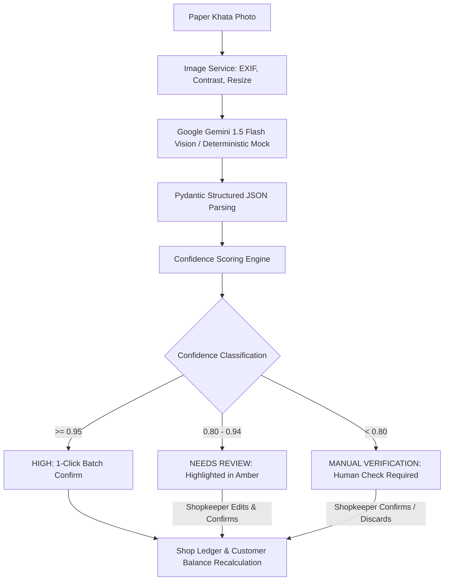

# KhataSetu — AI Vision & Extraction Pipeline

## Pipeline Overview



## 1. Image Preprocessing (`image_service.py`)
- **Orientation Correction:** Checks EXIF metadata and fixes photo orientation.
- **Contrast & Grayscale Optimization:** Applies contrast stretching and sharpening to make faded pen marks and pencil text legible.
- **Downsampling:** Ensures image dimensions don't exceed model limits while preserving text sharpness.

## 2. Gemini Vision Prompt Engineering (`ocr_service.py`)
- Utilizes Google Gemini 1.5 Flash with strict JSON formatting instructions.
- Returns an array of structured JSON objects:
  ```json
  {
    "entries": [
      {
        "customer_name": "Suresh Gupta",
        "amount": 250.0,
        "transaction_type": "CREDIT",
        "date_str": "12/03/2026",
        "notes": "Dal, Sugar",
        "raw_text": "सुरेश गुप्ता - दाल, चीनी - 250 बाकी",
        "field_confidences": {
          "customer_name": 0.96,
          "amount": 0.98,
          "transaction_type": 0.95,
          "date": 0.92
        }
      }
    ]
  }
  ```

## 3. Confidence Calculation Formula (`confidence_service.py`)
The overall confidence score $C$ is computed using a weighted linear combination:

$$C = 0.40 \cdot C_{\text{amount}} + 0.35 \cdot C_{\text{name}} + 0.15 \cdot C_{\text{date}} + 0.10 \cdot C_{\text{type}}$$

### Financial Safety Cap
Because monetary accuracy is critical in Kirana accounting:
$$\text{If } C_{\text{amount}} < 0.80 \text{ or } C_{\text{name}} < 0.80 \implies C = \min(C, 0.79)$$
This guarantees that transactions with uncertain monetary values or ambiguous debtor identities are never marked as `HIGH` confidence.

## 4. Name Matching & Normalization (`matching_service.py`)
- Removes common Hindi/Indian honorific suffixes: *bhai, ji, saheb, seth, babu, uncle, kaka*.
- Calculates Levenshtein Distance and Token Overlap against existing shop customers.
- If match similarity $> 0.85$, associates entry with the matched customer automatically; otherwise flags as a new customer candidate.
